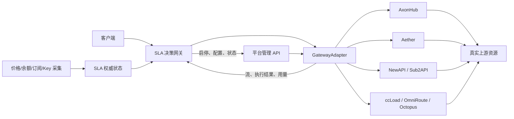

# 外部 SLA 控制边界

## 1. 推荐边界

本项目采用“平台无关 SLA 决策网关 + GatewayAdapter + 执行数据面”。首个适配器使用 stock AxonHub；Aether、ccLoad、OmniRoute、NewAPI、Sub2API 和 Octopus 可以按能力等级接入。外部组件不是只在后台调整权重，而是统一接收客户端请求、完成本轮资源决策，并在首有效内容提交前决定继续、取消或切换资源。

该结构保持各执行平台源码不变。外部组件新增的能力属于本项目自身，不形成难以与上游合并的私有平台分支。

## 2. 资源映射规则

PRD 中的“资源”是 `真实上游 + 账号 + Key + 模型/权限 + 地区`，不能直接等同于任一平台的宽泛渠道、Group 或 Account。

推荐映射：

1. 一个实际 Key/账号建立一个平台执行绑定：AxonHub 使用单渠道 Profile；Aether 使用单 Key Routing Group；ccLoad 使用单 Key/URL Channel + 单 Channel Token；OmniRoute 使用单 Key Connection + 单 Connection 白名单 API Key；NewAPI 使用单 Key Channel；Sub2API 使用单账号 Group/API Key；bestruirui/octopus 只能使用私有 model alias + 单资源 Group/Channel。
2. 外部决策网关保存 `resource_id → ExecutionBinding` 映射，客户端永远看不到内部凭证。
3. 只有适配器能证明实际资源身份时，资源才可进入严格 SLA 流量。
4. 多个实际资源共享同一上游账号余额或订阅额度的关系只在外部权威状态中维护，不在平台内部重复计算。

这样可以避免平台内部轮换 Key 导致缓存作用域变化，也能让每次执行结果关联到实际资源。Aether Pool、OmniRoute `extraApiKeys`、ccLoad 多 Key/URL Channel、NewAPI 多 Key Channel、Sub2API 多账号 Group 和 Octopus 多资源 Group 均不得用于严格 Key 归因。

## 3. 同步请求路径

下列决策必须在每次请求前或首字提交前完成，不能依赖异步 Webhook：

| 阶段 | 外部 SLA 决策网关职责 | GatewayAdapter / 执行平台职责 |
| --- | --- | --- |
| 准入 | 校验租户、数据许可、模型能力、价格/订阅有效性、可路由余额、容量和副作用限制 | 验证内部 API Key、执行基础模型映射 |
| 候选生成 | 排除不合格资源，考虑共享余额/订阅额度、故障域、缓存作用域和接管容量 | 单资源绑定只保留指定 Channel、Group、Profile 或 Routing Group |
| 本轮选择 | 根据会话前缀 TTFT、实际成功成本、缓存损失、健康可信度、探索资格和预计到期未用额度选择资源；订阅加权不得突破成本或引流上限 | 将 `RoutePlan` 翻译为平台请求 |
| 首字观察 | 按会话剩余预算决定等待、取消和切换；尚未提交前可重新请求另一资源 | 输出流、传播取消、记录本次尝试；能力不足时显式返回降级字段 |
| 提交后 | 已有有效内容后不拼接另一模型；记录用户真实体验 | 继续转发或报告流中断 |
| 完成 | 更新会话、探索、成本、缓存、订阅消耗和故障域状态 | 提供执行、Token、缓存 Token、费用和错误回执 |

### 请求路径故障原则

- 外部决策网关不可用时不得绕过策略直接访问任意上游；应返回明确不可用结果。
- 价格或余额不能形成保守下限时，相关付费资源不得接收新请求。
- 订阅状态过期、共享范围不明或无法确认仍有效时，不执行到期优先；不能安全利用的额度允许到期并记录原因。
- 平台管理 API 暂时不可用时，不影响已确认绑定的执行；但不得把未成功写入的状态视为已生效。
- 客户端断开和接管取消必须传播到目标平台；用户真实经历的时延和失败始终写入 SLA 账目。

## 4. 异步控制路径

下列工作不应阻塞单次请求：

- 定时采集 NewAPI/Sub2API 价格、用户组倍率、Key 倍率、账号余额、Key 额度、权限和订阅状态。
- 维护订阅计划的固定费用、总额度、剩余额度、有效期、共享范围、续订状态和超额计费规则。
- 形成价格、汇率、余额、订阅、策略和人工覆盖的不可覆盖版本。
- 预测订阅到期前的合格业务消耗和预计未用额度，计算固定费用分摊并核对实际消耗。
- 聚合 P50/P95/P99、成功率、缓存率、费用差异和故障域事件。
- 根据预算和样本陈旧程度分配后续业务测活资格。
- 通过对应平台管理 API 更新 Channel、Key、Group、Profile 状态和慢速权重。
- 生成告警、事件生命周期、日周摘要和审计记录。

各平台的自动停用、Monitor 或 Webhook 只能作为异步输入，不能作为唯一健康来源，也不能用于改变已进入请求链路的当次选择。

## 5. 状态所有权

| 状态 | 权威所有者 | 执行平台中的用途 |
| --- | --- | --- |
| 真实资源、账号共享关系、故障域 | 外部 SLA 状态 | 映射为 Channel、Connection、Group、Profile 或 Routing Group |
| 价格来源、倍率、币种、可信确认、版本 | 外部 SLA 状态 | 可同步当前展示/成本价格 |
| 账号余额、Key 额度、费用预留、安全储备 | 外部 SLA 状态 | 平台 quota/订阅额度仅作辅助证据 |
| 订阅计划、固定费用分摊、有效期、共享额度、预计到期未用额度、成本和引流上限 | 外部 SLA 状态 | 平台月度额度、窗口结束时间和重置亲和只作采集或调度参考 |
| 会话前缀 TTFT、缓存作用域、补偿模式 | 外部 SLA 状态 | Trace/Key 亲和仅作执行辅助 |
| 业务测活预算、冷却和历史 | 外部 SLA 状态 | 被选中时按普通真实请求执行 |
| 上游凭证、协议转换、流式连接 | 执行平台 | 核心执行能力 |
| 每次请求执行、错误、首 Token、Token 用量 | 平台原始记录；外部归档 | 外部账目和健康学习的输入 |
| SLA 目标、错误预算、告警和策略版本 | 外部 SLA 状态 | 不写入执行平台核心 |

## 6. 适配器能力契约

严格 SLA 适配器至少声明：

- `exact_resource_select`：能否确定到 Key 或账号级真实资源。
- `precommit_stream_visibility`：能否在向客户端提交有效内容前观察流。
- `cancel_propagation`：客户端断开或接管时能否取消上游请求。
- `attempt_trace`：能否关联每次平台尝试、实际资源和上游请求 ID。
- `cache_usage` 与 `cost_usage`：能否提供缓存 Token、费用和价格引用。
- `quota_usage`：能否返回实际消耗、额度窗口和重置时间；缺失时由外部采集器核对，不得推断。

缺少任一关键能力时，适配器只能参与非严格流量，或明确返回 `degraded_fields`；不能把平台内部的权重、数据间隔超时或最终请求日志冒充完整 SLA 能力。

## 7. 为什么不采用“只调全局权重”

全局权重无法表达同一时刻不同会话的剩余 TTFT 预算、缓存归属、租户许可、探索资格、余额预留和订阅到期紧迫度。即使每秒刷新权重，也会让一个会话的决策影响其他会话，并产生频繁迁移。

因此全局权重只用于慢速容量分配和紧急降级；逐请求资源选择必须由外部决策网关完成。

## 8. 为什么不采用同步 Webhook

候选平台现有 Webhook、Channel Monitor 和自动停用通知均属于异步事件，无法返回当次候选顺序、动态首字等待时间或会话预算。本选型不依赖不存在的同步扩展能力。

## 9. 侵入等级结论

推荐结构对 AxonHub 为 L0；Aether、ccLoad、NewAPI 和 Sub2API 也可在预建单资源绑定下采用 L0。OmniRoute 只有在单 Connection 白名单且单 Key 时为受限 L0；bestruirui/octopus 的私有 model alias 绑定同样是受限 L0，不能视为正式路由契约。它们成立的共同前提是外部 SLA 决策网关位于同步请求路径，并自行处理订阅账本、首有效内容、取消和 Attempt。

若组织不接受额外同步一跳，并要求任一平台自己完成逐请求外部决策，则必须增加受认证的 RoutePlan 输入、精确资源选择和流式接管接口，至少为 L2；这不属于本次推荐结构。
