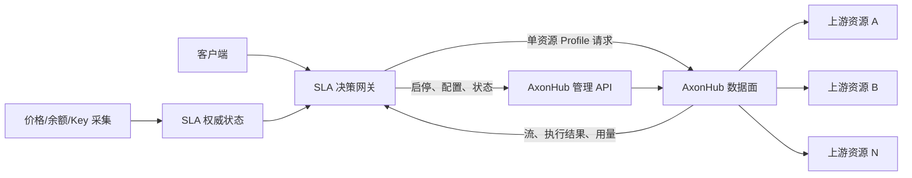

# 外部 SLA 控制边界

## 1. 推荐边界

本项目采用“外部 SLA 决策网关 + stock AxonHub 执行数据面”。外部组件不是只在后台调整权重，而是统一接收客户端请求、完成本轮资源决策，并在首字提交前决定继续、取消或切换资源。

该结构保持 AxonHub 源码不变。外部组件新增的能力属于本项目自身，不形成难以与上游合并的私有 AxonHub 分支。

## 2. 资源映射规则

PRD 中的“资源”是 `真实上游 + 账号 + Key + 模型/权限 + 地区`，不能直接等同于 AxonHub 的宽泛渠道。

推荐映射：

1. 一个实际 Key 配置为一个 AxonHub 渠道，该渠道只保存一个上游 Key。
2. 一个实际资源建立一个只允许该渠道的 AxonHub API Key Profile。
3. 外部决策网关保存 `resource_id → AxonHub Profile credential` 映射，客户端永远看不到内部 Profile 凭证。
4. 多个实际资源共享同一上游账号余额的关系只在外部权威状态中维护，不在 AxonHub 内重复计算。

这样可以避免 AxonHub 在一个渠道内轮换 Key 导致缓存作用域变化，也能让每次执行结果准确关联到实际资源。

## 3. 同步请求路径

下列决策必须在每次请求前或首字提交前完成，不能依赖异步 Webhook：

| 阶段 | 外部 SLA 决策网关职责 | AxonHub 职责 |
| --- | --- | --- |
| 准入 | 校验租户、数据许可、模型能力、价格有效性、可路由余额、容量和副作用限制 | 验证内部 API Key、执行基础模型映射 |
| 候选生成 | 排除不合格资源，考虑故障域、缓存作用域和接管容量 | 不生成跨资源候选；单资源 Profile 只留下指定渠道 |
| 本轮选择 | 根据会话前缀 TTFT、成本、缓存损失、健康可信度和探索资格选择资源 | 使用选定渠道完成协议转换和上游调用 |
| 首字观察 | 按会话剩余预算决定等待、取消和切换；尚未提交前可重新请求另一资源 | 输出流、传播取消、记录本次尝试 |
| 提交后 | 已有有效内容后不拼接另一模型；记录用户真实体验 | 继续转发或报告流中断 |
| 完成 | 更新会话、探索、成本、缓存和故障域状态 | 提供执行、Token、缓存 Token、费用和错误回执 |

### 请求路径故障原则

- 外部决策网关不可用时不得绕过策略直接访问任意上游；应返回明确不可用结果。
- 价格或余额不能形成保守下限时，相关付费资源不得接收新请求。
- AxonHub 管理 API 暂时不可用时，不影响已确认 Profile 的执行；但不得把未成功写入的状态视为已生效。
- 客户端断开和接管取消必须传播到 AxonHub；用户真实经历的时延和失败始终写入 SLA 账目。

## 4. 异步控制路径

下列工作不应阻塞单次请求：

- 定时采集 NewAPI/Sub2API 价格、用户组倍率、Key 倍率、账号余额、Key 额度和权限。
- 形成价格、汇率、余额、策略和人工覆盖的不可覆盖版本。
- 聚合 P50/P95/P99、成功率、缓存率、费用差异和故障域事件。
- 根据预算和样本陈旧程度分配后续业务测活资格。
- 通过 AxonHub 管理 API 更新渠道启停、Key 状态、价格展示值和全局权重。
- 生成告警、事件生命周期、日周摘要和审计记录。

AxonHub 的 `channel.auto_disabled` Webhook 可作为异步输入，但不能作为唯一健康来源，也不能用于改变已进入请求链路的当次选择。

## 5. 状态所有权

| 状态 | 权威所有者 | AxonHub 中的用途 |
| --- | --- | --- |
| 真实资源、账号共享关系、故障域 | 外部 SLA 状态 | 映射为渠道与 Profile |
| 价格来源、倍率、币种、可信确认、版本 | 外部 SLA 状态 | 可同步当前展示/成本价格 |
| 账号余额、Key 额度、费用预留、安全储备 | 外部 SLA 状态 | Provider quota 仅作辅助证据 |
| 会话前缀 TTFT、缓存作用域、补偿模式 | 外部 SLA 状态 | Trace/Key 亲和仅作执行辅助 |
| 业务测活预算、冷却和历史 | 外部 SLA 状态 | 被选中时按普通真实请求执行 |
| 上游凭证、协议转换、流式连接 | AxonHub | 核心执行能力 |
| 每次请求执行、错误、首 Token、Token 用量 | AxonHub 原始记录；外部归档 | 外部账目和健康学习的输入 |
| SLA 目标、错误预算、告警和策略版本 | 外部 SLA 状态 | 不写入 AxonHub 核心 |

## 6. 为什么不采用“只调全局权重”

全局权重无法表达同一时刻不同会话的剩余 TTFT 预算、缓存归属、租户许可、探索资格和余额预留。即使每秒刷新权重，也会让一个会话的决策影响其他会话，并产生频繁迁移。

因此全局权重只用于慢速容量分配和紧急降级；逐请求资源选择必须由外部决策网关完成。

## 7. 为什么不采用同步 Webhook

AxonHub 没有请求前同步 Webhook。现有 Webhook 在渠道自动停用后异步发送，无法返回候选顺序、动态首字等待时间或会话预算。本选型不依赖不存在的扩展能力。

## 8. 侵入等级结论

推荐结构对 AxonHub 为 L0，不修改上游源码。它成立的明确前提是外部 SLA 决策网关处于同步请求路径。

若组织不接受额外同步一跳，并要求 AxonHub 自己完成逐请求外部决策，则必须增加受认证的路由计划输入或外部决策接口，至少为 L2；这不属于本次推荐结构。
